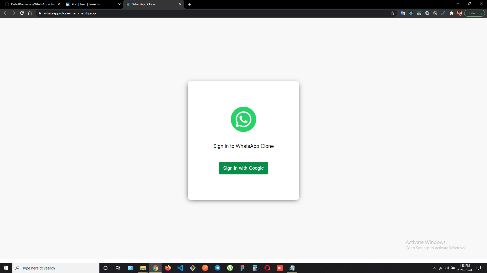
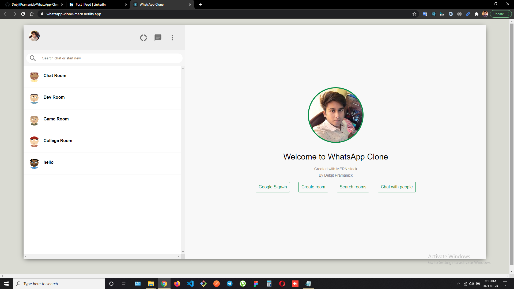
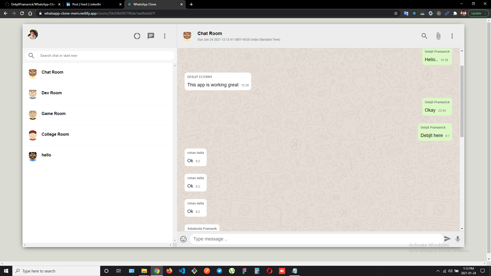

# WHATSAPP CLONE

Hi! I'm Debjit, a **MERN Stack Developer**. This is a clone of popular chat application **WhatsApp**.
I have created it with **React** in frontend,  **Node and Express** for backend and **MongoDB** for storing data.
 
 
> ### Web App Link - https://whatsapp-clone-mern.netlify.app/

 

## Features

- Google Sign-in.
- Create Room.
- Chat with people
- Search rooms.

##  NPM Packages Used

- React-redux
- Material UI
- Express
- Nodemon
- Mongoose

## Screenshots

 

 

